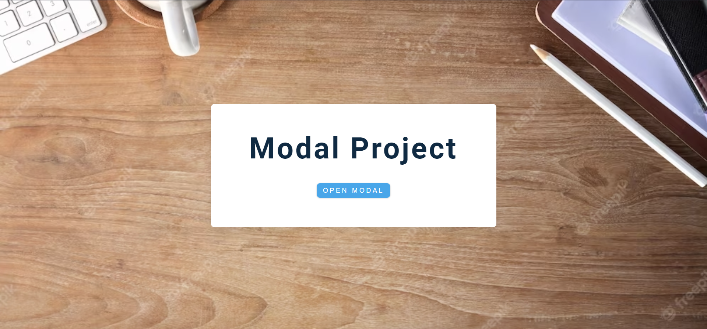

# Modal

El proyecto consiste en la creación de un modal utilizando JavaScript. Un modal es una ventana emergente que se muestra encima del contenido principal de una página web y que permite al usuario interactuar con ella sin salir de la página actual.

## Visualizacion

